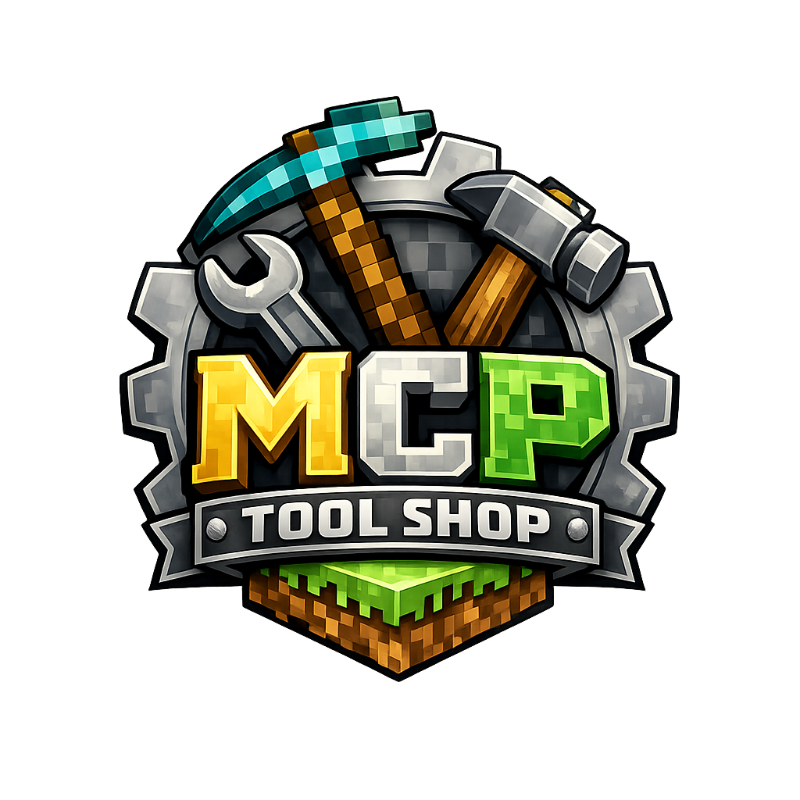

<p align="center">
  <a href="README.ja.md">日本語</a> | <a href="README.zh.md">中文</a> | <a href="README.es.md">Español</a> | <a href="README.fr.md">Français</a> | <a href="README.hi.md">हिन्दी</a> | <a href="README.it.md">Italiano</a> | <a href="README.pt-BR.md">Português (BR)</a>
</p>

<p align="center">
  
</p>

<p align="center">
  <a href="https://github.com/mcp-tool-shop-org/.github/actions/workflows/docs-quality.yml"></a>
  <a href="LICENSE"></a>
  <a href="https://mcp-tool-shop-org.github.io/.github/"></a>
</p>

**Production-grade MCP servers, desktop apps, and AI infrastructure — built for developers with local GPU workstations.**

No cloud required. No API keys for core functionality. Runs on Ollama, RTX, and your own hardware.

## Contents

- **Community health files** — CODE_OF_CONDUCT.md, CONTRIBUTING.md, SECURITY.md, SUPPORT.md, LICENSE
- **Org profile** — profile/README.md (appears on the org's GitHub page)
- **Brand assets** — brand/ directory with palette and OG manifests
- **CI guardrails** — Docs quality checks and org drift guard workflows
- **Org docs** — Releasing, versioning, maintenance, branch policy, badges

## Workflows

| Workflow | Trigger | Purpose |
|----------|---------|---------|
| `docs-quality.yml` | Push/PR on `**/*.md` | Markdown lint + link check |
| `org-guard.yml` | PR on workflows/docs | Org standards compliance scanner |

## Quick Start

```bash
# Discover and run MCP Tool Shop tools
pip install mcpt
mcpt search "semantic file search"
```

See the [landing page](https://mcp-tool-shop-org.github.io/.github/) for the full tool directory.

## License

MIT
